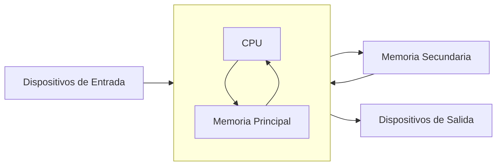
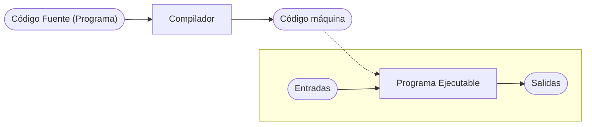
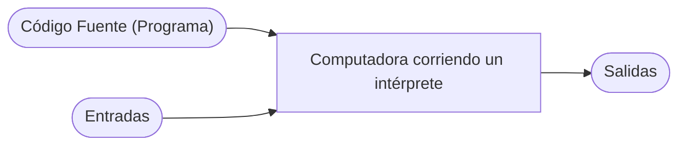

# Computadoras y programas

## Objetivos

- Comprender los respectivos roles del hardware y el software en los sistemas informáticos.

- Aprender qué estudian los informáticos y las técnicas que utilizan. 

- Comprender el diseño básico de una computadora moderna.

- Comprender la forma y función de los lenguajes de programación informática.

- Comenzar a utilizar el lenguaje de programación Python.

- Aprender sobre modelos caóticos y sus implicaciones para la informática.

***

## 1.1. La máquina universal

Casi todo el mundo ha utilizado una computadora en algún momento. Quizás hayas jugado juegos en ella o la hayas usado para escribir un artículo, comprar en línea, escuchar música o conectarte con tus amigos a través de redes sociales. 

Las computadoras se utilizan para predecir el clima, diseñar aviones, hacer películas, administrar negocios, realizar transacciones financieras y controlar fábricas.
¿Alguna vez te has parado a preguntarte qué es exactamente una computadora? ¿Cómo puede un dispositivo realizar tantas tareas diferentes? Estas preguntas básicas son el punto de partida para aprender sobre computadoras y programación de computadoras.

Una computadora moderna puede definirse como: *"una máquina que almacena y manipula información bajo el control de un programa modificable".* 

Hay dos elementos clave en esta definición: 

- **La primera es que las computadoras son dispositivos para manipular información.** 

- **La segunda es que las computadoras funcionan bajo el control de un programa modificable.**

Comencemos analizando que quiere decir que **las computadoras son dispositivos para manipular información**.

Esto significa que podemos poner información en una computadora, y ésta puede transformarla en formas nuevas y útiles, y luego generar o mostrar la información para nuestra interpretación.

Las computadoras no son las únicas máquinas que manipulan información. Cuando usa una calculadora simple para sumar una columna de números, está ingresando información (los números) y la calculadora procesa la información para calcular una suma acumulada que luego se muestra.


Otro ejemplo sencillo es una bomba de gasolina. A medida que llena el tanque, la bomba utiliza ciertas entradas: el precio actual de la gasolina por litro y señales de un sensor que lee la tasa de gasolina que fluye hacia el automóvil. La bomba transforma esta información en información sobre cuánta gasolina consumió y cuánto dinero debe.


No consideraríamos ni la calculadora ni el surtidor de gasolina como *computadoras completas*, porque son sistemas diseñados para realizar una tarea única y específica, mientras que una computadora completa **funciona bajo el control de un programa modificable.** ¿Qué significa esto exactamente?

!!! info "¿Qué es un programa?"
    Un **programa** es un conjunto detallado de instrucciones paso a paso que le dicen a una computadora exactamente qué hacer.

Si cambiamos el programa, entonces la computadora realiza una secuencia diferente de acciones y, por lo tanto, realiza una tarea diferente. Es esta flexibilidad la que permite que tu PC sea en un momento un procesador de textos, en el siguiente un planificador financiero y, más tarde, un juego de arcade. La máquina sigue siendo la misma, pero el programa que la controla cambia.

Cada computadora es solo una máquina para ejecutar (realizar) programas. Hay muchos tipos diferentes de computadoras. Es posible que estés familiarizado con MACs, PC, laptops, tabletas y teléfonos inteligentes, pero hay literalmente miles de otros tipos de computadoras, tanto reales como teóricas. Uno de los descubrimientos notables de la informática es la constatación de que todas estas computadoras diferentes tienen el mismo poder; Con una programación adecuada, cada computadora puede hacer básicamente todas las cosas que cualquier otra computadora puede hacer. En este sentido, la PC que puedas tener sobre tu escritorio es realmente una máquina universal. Puede hacer cualquier cosa que desees, siempre que puedas describir la tarea a realizar con suficiente detalle. ¡Esa sí que es una máquina poderosa!

***

## 1.2. El poder de los programas

Ya has aprendido una importante lección de informática: **el software (programas) gobierna el hardware (la máquina física).** 

Es el software el que determina lo que cualquier computadora puede hacer. Sin software, las computadoras serían simplemente pisapapeles costosos. El proceso de creación de software se llama **programación** y ese es el tema principal de esta guía.

La programación informática es una actividad desafiante. La buena programación requiere la capacidad de ver el panorama general y al mismo tiempo prestar atención a los detalles minuciosos. No todo el mundo tiene el talento para convertirse en un programador de primera, del mismo modo que no todo el mundo tiene las habilidades para ser un atleta profesional. Sin embargo, prácticamente cualquier persona puede aprender a programar computadoras. Con un poco de paciencia y esfuerzo de tu parte, esta guía te ayudará a convertirte en programador.

Hay muchas buenas razones para aprender a programar. La programación es una parte fundamental de la informática y, por lo tanto, es importante para cualquier persona interesada en convertirse en un profesional de la informática. Pero otros también pueden beneficiarse de la experiencia. Las computadoras se han convertido en una herramienta común en nuestra sociedad. Comprender las fortalezas y limitaciones de esta herramienta requiere conocimientos de programación. Los no programadores a menudo se sienten esclavos de sus computadoras. Los programadores, sin embargo, tienen realmente el control. Si deseas aprovechar al máximo tu computadora, debes aprender a programar.

La programación también puede ser muy divertida. Es una actividad intelectualmente atractiva que permite a las personas expresarse a través de creaciones útiles y, a veces, notablemente hermosas. Lo creas o no, muchas personas escriben programas de computadora como pasatiempo. La programación también desarrolla valiosas habilidades para la resolución de problemas, especialmente la capacidad de analizar sistemas complejos reduciéndolos a interacciones de subsistemas comprensibles.

***

## 1.3. ¿Qué es la informática?

Quizás te sorprenda saber que la informática no es el estudio de las computadoras. 
Un famoso informático llamado [Edsger Dijkstra](https://es.wikipedia.org/wiki/Edsger_Dijkstra) bromeó una vez diciendo que las computadoras son para la informática lo que los telescopios son para la astronomía. La computadora es una herramienta importante en informática, pero no es en sí misma el objeto de estudio. Dado que una computadora puede llevar a cabo cualquier proceso que podamos describir, la verdadera pregunta es: **"¿Qué procesos podemos describir?"** 

Para decirlo de otra manera, la cuestión fundamental de la informática es simplemente **"¿Qué información se puede procesar automáticamente?"** Los informáticos utilizan numerosas técnicas de investigación para responder a esta pregunta. Los tres principales son: 

- [El diseño](./01_Computadoras_y_programas.md/#diseño) 

- [El análisis](./01_Computadoras_y_programas.md/#análisis)  

- [La experimentación](./01_Computadoras_y_programas.md/#experimentación)


### Diseño

Una manera de demostrar que un problema particular puede resolverse es **diseñar** realmente una solución. Es decir, desarrollamos un proceso paso a paso para lograr el resultado deseado. Los informáticos llaman a esto algoritmo. Es una palabra elegante que básicamente significa "receta". El diseño de algoritmos es una de las facetas más importantes de la informática. En esta guía encontrarás técnicas para diseñar e implementar algoritmos.

??? tip "Definición de algoritmo"
    En matemáticas, lógica, ciencias de la computación y disciplinas relacionadas, un algoritmo es un conjunto de instrucciones o reglas definidas, no-ambiguas, ordenadas y finitas que permite, típicamente, solucionar un problema.

Una debilidad del diseño es que sólo puede responder a la pregunta "¿Qué es automatizable?". Si puedo idear un algoritmo, entonces el problema tiene solución. Sin embargo, no encontrar un algoritmo no significa que el problema no tenga solución. Puede significar que simplemente no soy lo suficientemente inteligente o que aún no se me ha ocurrido la idea correcta. Aquí es donde entra el **análisis**.

### Análisis

El análisis es el proceso de examinar algoritmos y problemas matemáticamente. Los informáticos han demostrado que algunos problemas aparentemente simples no pueden resolverse mediante ningún algoritmo. Otros problemas son intratables. Los algoritmos que resuelven estos problemas toman demasiado tiempo o requieren demasiada memoria para tener valor práctico. El análisis de algoritmos es una parte importante de la informática; A lo largo de esta guía abordaremos algunos de los principios fundamentales. La sección [Diseño de algortimos y recursión](./13_Diseño_de_algoritmos_y_recursión.md) tiene ejemplos de problemas irresolubles e intratables.

### Experimentación

Algunos problemas son demasiado complejos o están mal definidos para prestarse a un análisis. En tales casos, los informáticos se basan en la experimentación; en realidad implementan sistemas y luego estudian el comportamiento resultante. Incluso cuando se realiza un análisis teórico, a menudo se necesita experimentación para verificar y refinar el análisis. Para la mayoría de los problemas, lo fundamental es si se puede construir un sistema que funcione y sea confiable. A menudo requerimos pruebas empíricas del sistema para determinar que se ha cumplido este objetivo. Cuando comiences a escribir tus propios programas, tendrás muchas oportunidades para observar tus soluciones en acción.

Hemos definido la informática en términos de diseño, análisis y evaluación de algoritmos, y este es sin duda el núcleo de la disciplina académica. Hoy en día, sin embargo, los informáticos participan en actividades muy amplias, todas las cuales caen bajo el paraguas general de la informática. Algunos ejemplos incluyen computación móvil, redes, interacción persona-computadora, inteligencia artificial, ciencia computacional (uso de computadoras poderosas para modelar procesos científicos), bases de datos y minería de datos, ingeniería de software, diseño web y multimedia, producción musical, sistemas de gestión de información y seguridad informática. Dondequiera que se existan computadoras, se aplican las habilidades y conocimientos de la informática.

***

## 1.4. Conceptos básicos de hardware

No es necesario conocer todos los detalles de cómo funciona una computadora para ser un programador exitoso, pero comprender los principios subyacentes te ayudará a dominar el procedimiento para poner nuestros programas en acción. Es un poco como conducir un coche. Saber un poco sobre los motores de combustión interna ayuda a explicar por qué hay que hacer cosas como llenar el tanque de gasolina, arrancar el motor, pisar el acelerador, etc. Podrías aprender a conducir simplemente memorizando qué hacer, pero un poco más de conocimiento hace que todo el proceso sea mucho más comprensible. Tomémonos un momento para mirar qué hay dentro de tu computadora.



Aunque diferentes computadoras pueden variar significativamente en detalles específicos, en general todas las computadoras digitales modernas son notablemente similares. El gráfico anterior muestra una vista funcional de una computadora. La unidad central de procesamiento (CPU) es el "cerebro" de la máquina. Aquí es donde se llevan a cabo todas las operaciones básicas de la computadora. La CPU puede realizar operaciones aritméticas simples como sumar dos números y también puede realizar operaciones lógicas como comparar si dos números son iguales.

La memoria almacena programas y datos. La CPU puede acceder directamente sólo a la información almacenada en la memoria principal, llamada RAM que significa "Memoria de Acceso Aleatorio". La memoria principal es rápida, pero también volátil. Es decir, cuando se corta la alimentación, la información de la memoria se pierde. Por tanto, también debe haber alguna memoria secundaria que proporcione un almacenamiento más permanente.

En una computadora personal moderna, la memoria secundaria suele ser una unidad de disco duro interna (HDD) o una unidad de estado sólido (SSD). Un HDD almacena información como patrones magnéticos en un disco giratorio, mientras que un SSD emplea circuitos electrónicos conocidos como memoria flash. La mayoría de las computadoras también admiten medios extraíbles para la memoria secundaria, como "memorias USB" (también una forma de memoria flash) y DVD (discos versátiles digitales), que almacenan información como patrones ópticos que se leen y escriben mediante un láser.

Los humanos interactúan con la computadora a través de dispositivos de entrada y salida. Probablemente estés familiarizado con dispositivos comunes como el teclado, el mouse y el monitor (pantalla de video). El CPU procesa la información de los dispositivos de entrada y puede transferirse a la memoria principal o secundaria. De manera similar, cuando es necesario mostrar información, la CPU la envía a uno o más dispositivos de salida.

Entonces, ¿qué sucede cuando inicias tu juego o programa de procesamiento de textos favorito? Primero, las instrucciones que componen el programa se copian desde la persistente memoria secundaria a la volátil memoria principal de la computadora.

Una vez cargadas las instrucciones, la CPU comienza a ejecutar el programa.

Técnicamente, la CPU sigue un proceso llamado ciclo de búsqueda-ejecución. La primera instrucción se recupera de la memoria, se decodifica para descubrir qué representa, y ejecuta la acción apropiada. Luego busca, decodifica y ejecuta la siguiente instrucción. El ciclo continúa, instrucción tras instrucción. En realidad, esto es todo lo que hace la computadora desde el momento en que la enciendes hasta que la vuelves a apagar: buscar, decodificar y ejecutar. No parece muy emocionante, ¿verdad? Pero la computadora puede ejecutar este flujo de instrucciones simples a una velocidad vertiginosa, pasando por miles de millones de instrucciones cada segundo. Si reúne suficientes instrucciones sencillas en la forma correcta, la computadora hará cosas asombrosas.

***

## 1.5. Lenguajes de programación

Recuerda que un programa es sólo una secuencia de instrucciones que le dicen a una computadora qué hacer. Obviamente, debemos proporcionar esas instrucciones en un idioma que una computadora pueda entender. Sería bueno si pudiéramos decirle a una computadora qué hacer usando nuestra lengua materna, como lo hacen en las películas de ciencia ficción. Los científicos computacionales han hecho grandes avances en esta dirección; Es posible que estés familiarizado con tecnologías como Siri (Apple), Google Now (Android) y Cortana (Microsoft). Pero como puede atestiguar cualquiera que haya utilizado seriamente estos sistemas, diseñar un programa informático para comprender plenamente el lenguaje humano sigue siendo un problema sin resolver, aunque cada vez es más facil interactuar con IAs como los chats que usan modelos como GPT.

Incluso si las computadoras pudieran entendernos, los lenguajes humanos no son muy adecuados para describir algoritmos complejos. El lenguaje natural está plagado de ambigüedad e imprecisión. Por ejemplo, si digo "Vi al hombre en el parque con el telescopio", ¿tenía yo el telescopio o el hombre? ¿Y quién estaba en el parque? Nos entendemos la mayor parte del tiempo sólo porque todos los humanos compartimos un vasto acervo de conocimientos y experiencias comunes. Incluso entonces, la falta de comunicación es algo común.

Los matemáticos/informáticos han solucionado este problema diseñando notaciones para expresar los cálculos de una manera exacta e inequívoca. Estas notaciones especiales se denominan lenguajes de programación. Cada estructura en un lenguaje de programación tiene una forma precisa (su sintaxis) y un significado preciso (su semántica). 

Un lenguaje de programación es algo así como un código para escribir las instrucciones que seguirá una computadora. De hecho, los programadores suelen referirse a sus programas como código de computadora, y el proceso de escribir un algoritmo en un lenguaje de programación se llama codificación.

Python es un ejemplo de lenguaje de programación y es el lenguaje que usaremos a lo largo de esta guía. Es posible que hayas oído hablar de otros lenguajes de uso común, como C++, Java, Javascript, Ruby, Perl, Scheme o BASIC. Los informáticos han desarrollado literalmente miles de lenguajes de programación, y los propios lenguajes evolucionan con el tiempo dando lugar a múltiples versiones, a veces muy diferentes. Aunque estos lenguajes difieren en muchos detalles, todos comparten la propiedad de tener una sintaxis y una semántica bien definidas y sin ambigüedades.

Todos los lenguajes mencionados anteriormente son ejemplos de lenguajes informáticos de alto nivel. Aunque son precisos, están diseñados para ser utilizados y comprendidos por humanos. Estrictamente hablando, el hardware de una computadora sólo puede comprender un lenguaje de muy bajo nivel conocido como lenguaje de máquina.

Supongamos que queremos que la computadora sume dos números. Las instrucciones que realmente lleva a cabo la CPU podrían ser algo como esto:

```MACHINE
    LOAD R1, 2001   ; Cargar el número desde la dirección de memoria 2001 en el registro R1
    LOAD R2, 2002   ; Cargar el número desde la dirección de memoria 2002 en el registro R2
    ADD R1, R2      ; Sumar el contenido de los registros R1 y R2 y almacenar el resultado en R1
    STORE 2003, R1  ; Almacenar el contenido del registro R1 en la dirección de memoria 2003
```

Parece mucho trabajo sumar dos números, ¿no? En realidad, es incluso más complicado que esto porque las instrucciones y los números se representan en notación binaria (como secuencias de O y 1).

```MACHINE
    0001 01 0000 0111 1101 ; LOAD R1, 2001
    0001 10 0000 0111 1101 ; LOAD R2, 2002
    0010 01 10 ; ADD R1, R2
    0011 01 0000 0111 1101 ; STORE 2003, R1
```

En un lenguaje de alto nivel como Python, la suma de dos números se puede expresar de forma más natural: c = a + b. 

Esto es mucho más fácil de entender para nosotros, pero necesitamos alguna forma de traducir el lenguaje de alto nivel al lenguaje de máquina que la computadora pueda ejecutar.

Hay dos formas de hacer esto: **un lenguaje de alto nivel puede compilarse o interpretarse**.

Un **compilador** es un programa informático complejo que toma otro programa escrito en un lenguaje de alto nivel y lo traduce a un programa equivalente en el lenguaje de máquina de alguna computadora.

El *programa de alto nivel* se llama *código fuente* y el *código de máquina* resultante es un *programa ejecutable* con el que la computadora puede interactuar directamente.

El usuario final solamente abre (ejecuta) el *programa ejecutable* e interactúa con él ingresando datos (entradas) y recibiendo los resultados (salidas).




Un **intérprete** es un programa que simula una computadora que comprende un lenguaje de alto nivel. En lugar de traducir el programa fuente a un equivalente en lenguaje de máquina, el intérprete analiza y ejecuta el código fuente instrucción por instrucción según sea necesario.



La diferencia entre interpretar y compilar es que la compilación es una traducción de una sola vez; Una vez compilado un programa, se puede ejecutar una y otra vez sin necesidad del compilador o del código fuente. En el caso interpretado, el intérprete y la fuente son necesarios cada vez que se ejecuta el programa. Los programas compilados tienden a ser más rápidos, ya que la traducción se realiza de una vez por todas, pero los lenguajes interpretados se prestan a un entorno de programación más flexible ya que los programas se pueden desarrollar y ejecutar de forma interactiva.

El proceso de traducción destaca otra ventaja que tienen los lenguajes de alto nivel sobre el lenguaje de máquina: la portabilidad. El lenguaje de máquina de una computadora lo crean los diseñadores de la CPU en particular. Cada tipo de computadora tiene su propio lenguaje de máquina. 

Un programa para el procesador Intel i7 de tu laptop no funcionará directamente en una la CPU ARMv8 de tu teléfono inteligente. Por otro lado, un programa escrito en un lenguaje de alto nivel se puede ejecutar en muchos tipos diferentes de computadoras siempre que exista un compilador o intérprete adecuado (que no es más que un programa más). Como resultado, podemos ejecutar exactamente el mismo programa Python en una computadora portátil y en una tableta; Aunque tienen CPU diferentes, ambos cuentan con un intérprete de Python.


***

## 1.6. La mágia de Python

***

## 1.7. Dentro de un programa de Python

***

## 1.8. Caos y computadoras 

***

## 1.9. Resumen del capítulo

***