# Computadoras y programas

## Objetivos

- Comprender los respectivos roles del hardware y el software en los sistemas informáticos.

- Aprender qué estudian los informáticos y las técnicas que utilizan. 

- Comprender el diseño básico de una computadora moderna.

- Comprender la forma y función de los lenguajes de programación informática.

- Comenzar a utilizar el lenguaje de programación Python.

- Aprender sobre modelos caóticos y sus implicaciones para la informática.

***

## 1.1. La máquina universal

Casi todo el mundo ha utilizado una computadora en algún momento. Quizás hayas jugado juegos en ella o la hayas usado para escribir un artículo, comprar en línea, escuchar música o conectarte con tus amigos a través de redes sociales. 

Las computadoras se utilizan para predecir el clima, diseñar aviones, hacer películas, administrar negocios, realizar transacciones financieras y controlar fábricas.
¿Alguna vez te has parado a preguntarte qué es exactamente una computadora? ¿Cómo puede un dispositivo realizar tantas tareas diferentes? Estas preguntas básicas son el punto de partida para aprender sobre computadoras y programación de computadoras.

Una computadora moderna puede definirse como: *"una máquina que almacena y manipula información bajo el control de un programa modificable".* 

Hay dos elementos clave en esta definición: 

- **La primera es que las computadoras son dispositivos para manipular información.** 

- **La segunda es que las computadoras funcionan bajo el control de un programa modificable.**

Comencemos analizando que quiere decir que **las computadoras son dispositivos para manipular información**.

Esto significa que podemos poner información en una computadora, y ésta puede transformarla en formas nuevas y útiles, y luego generar o mostrar la información para nuestra interpretación.

Las computadoras no son las únicas máquinas que manipulan información. Cuando usa una calculadora simple para sumar una columna de números, está ingresando información (los números) y la calculadora procesa la información para calcular una suma acumulada que luego se muestra.


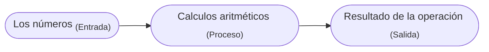


Otro ejemplo sencillo es una bomba de gasolina. A medida que llena el tanque, la bomba utiliza ciertas entradas: el precio actual de la gasolina por litro y señales de un sensor que lee la tasa de gasolina que fluye hacia el automóvil. La bomba transforma esta información en información sobre cuánta gasolina consumió y cuánto dinero debe.


No consideraríamos ni la calculadora ni el surtidor de gasolina como *computadoras completas*, porque son sistemas diseñados para realizar una tarea única y específica, mientras que una computadora completa **funciona bajo el control de un programa modificable.** ¿Qué significa esto exactamente?

!!! info "¿Qué es un programa?"
    Un **programa** es un conjunto detallado de instrucciones paso a paso que le dicen a una computadora exactamente qué hacer.

Si cambiamos el programa, entonces la computadora realiza una secuencia diferente de acciones y, por lo tanto, realiza una tarea diferente. Es esta flexibilidad la que permite que tu PC sea en un momento un procesador de textos, en el siguiente un planificador financiero y, más tarde, un juego de arcade. La máquina sigue siendo la misma, pero el programa que la controla cambia.

Cada computadora es solo una máquina para ejecutar (realizar) programas. Hay muchos tipos diferentes de computadoras. Es posible que estés familiarizado con MACs, PC, laptops, tabletas y teléfonos inteligentes, pero hay literalmente miles de otros tipos de computadoras, tanto reales como teóricas. Uno de los descubrimientos notables de la informática es la constatación de que todas estas computadoras diferentes tienen el mismo poder; Con una programación adecuada, cada computadora puede hacer básicamente todas las cosas que cualquier otra computadora puede hacer. En este sentido, la PC que puedas tener sobre tu escritorio es realmente una máquina universal. Puede hacer cualquier cosa que desees, siempre que puedas describir la tarea a realizar con suficiente detalle. ¡Esa sí que es una máquina poderosa!

***

## 1.2. El poder de los programas

Ya has aprendido una importante lección de informática: **el software (programas) gobierna el hardware (la máquina física).** 

Es el software el que determina lo que cualquier computadora puede hacer. Sin software, las computadoras serían simplemente pisapapeles costosos. El proceso de creación de software se llama **programación** y ese es el tema principal de esta guía.

La programación informática es una actividad desafiante. La buena programación requiere la capacidad de ver el panorama general y al mismo tiempo prestar atención a los detalles minuciosos. No todo el mundo tiene el talento para convertirse en un programador de primera, del mismo modo que no todo el mundo tiene las habilidades para ser un atleta profesional. Sin embargo, prácticamente cualquier persona puede aprender a programar computadoras. Con un poco de paciencia y esfuerzo de tu parte, esta guía te ayudará a convertirte en programador.

Hay muchas buenas razones para aprender a programar. La programación es una parte fundamental de la informática y, por lo tanto, es importante para cualquier persona interesada en convertirse en un profesional de la informática. Pero otros también pueden beneficiarse de la experiencia. Las computadoras se han convertido en una herramienta común en nuestra sociedad. Comprender las fortalezas y limitaciones de esta herramienta requiere conocimientos de programación. Los no programadores a menudo se sienten esclavos de sus computadoras. Los programadores, sin embargo, tienen realmente el control. Si deseas aprovechar al máximo tu computadora, debes aprender a programar.

La programación también puede ser muy divertida. Es una actividad intelectualmente atractiva que permite a las personas expresarse a través de creaciones útiles y, a veces, notablemente hermosas. Lo creas o no, muchas personas escriben programas de computadora como pasatiempo. La programación también desarrolla valiosas habilidades para la resolución de problemas, especialmente la capacidad de analizar sistemas complejos reduciéndolos a interacciones de subsistemas comprensibles.

***

## 1.3. ¿Qué es la informática?

Quizás te sorprenda saber que la informática no es el estudio de las computadoras. 
Un famoso informático llamado [Edsger Dijkstra](https://es.wikipedia.org/wiki/Edsger_Dijkstra) bromeó una vez diciendo que las computadoras son para la informática lo que los telescopios son para la astronomía. La computadora es una herramienta importante en informática, pero no es en sí misma el objeto de estudio. Dado que una computadora puede llevar a cabo cualquier proceso que podamos describir, la verdadera pregunta es: **"¿Qué procesos podemos describir?"** 

Para decirlo de otra manera, la cuestión fundamental de la informática es simplemente **"¿Qué información se puede procesar automáticamente?"** Los informáticos utilizan numerosas técnicas de investigación para responder a esta pregunta. Los tres principales son: 

- [El diseño](./01_Computadoras_y_programas.md/#diseño) 

- [El análisis](./01_Computadoras_y_programas.md/#análisis)  

- [La experimentación](./01_Computadoras_y_programas.md/#experimentación)


### Diseño

Una manera de demostrar que un problema particular puede resolverse es **diseñar** realmente una solución. Es decir, desarrollamos un proceso paso a paso para lograr el resultado deseado. Los informáticos llaman a esto algoritmo. Es una palabra elegante que básicamente significa "receta". El diseño de algoritmos es una de las facetas más importantes de la informática. En esta guía encontrarás técnicas para diseñar e implementar algoritmos.

??? note "Definición de algoritmo"
    En matemáticas, lógica, ciencias de la computación y disciplinas relacionadas, un algoritmo es un conjunto de instrucciones o reglas definidas, no-ambiguas, ordenadas y finitas que permite, típicamente, solucionar un problema.

Una debilidad del diseño es que sólo puede responder a la pregunta "¿Qué es automatizable?". Si puedo idear un algoritmo, entonces el problema tiene solución. Sin embargo, no encontrar un algoritmo no significa que el problema no tenga solución. Puede significar que simplemente no soy lo suficientemente inteligente o que aún no se me ha ocurrido la idea correcta. Aquí es donde entra el **análisis**.

### Análisis

El análisis es el proceso de examinar algoritmos y problemas matemáticamente. Los informáticos han demostrado que algunos problemas aparentemente simples no pueden resolverse mediante ningún algoritmo. Otros problemas son intratables. Los algoritmos que resuelven estos problemas toman demasiado tiempo o requieren demasiada memoria para tener valor práctico. El análisis de algoritmos es una parte importante de la informática; A lo largo de esta guía abordaremos algunos de los principios fundamentales. La sección [Diseño de algortimos y recursión](./13_Diseño_de_algoritmos_y_recursión.md) tiene ejemplos de problemas irresolubles e intratables.

### Experimentación

Algunos problemas son demasiado complejos o están mal definidos para prestarse a un análisis. En tales casos, los informáticos se basan en la experimentación; en realidad implementan sistemas y luego estudian el comportamiento resultante. Incluso cuando se realiza un análisis teórico, a menudo se necesita experimentación para verificar y refinar el análisis. Para la mayoría de los problemas, lo fundamental es si se puede construir un sistema que funcione y sea confiable. A menudo requerimos pruebas empíricas del sistema para determinar que se ha cumplido este objetivo. Cuando comiences a escribir tus propios programas, tendrás muchas oportunidades para observar tus soluciones en acción.

Hemos definido la informática en términos de diseño, análisis y evaluación de algoritmos, y este es sin duda el núcleo de la disciplina académica. Hoy en día, sin embargo, los informáticos participan en actividades muy amplias, todas las cuales caen bajo el paraguas general de la informática. Algunos ejemplos incluyen computación móvil, redes, interacción persona-computadora, inteligencia artificial, ciencia computacional (uso de computadoras poderosas para modelar procesos científicos), bases de datos y minería de datos, ingeniería de software, diseño web y multimedia, producción musical, sistemas de gestión de información y seguridad informática. Dondequiera que se existan computadoras, se aplican las habilidades y conocimientos de la informática.

***

## 1.4. Conceptos básicos de hardware

No es necesario conocer todos los detalles de cómo funciona una computadora para ser un programador exitoso, pero comprender los principios subyacentes te ayudará a dominar el procedimiento para poner nuestros programas en acción. Es un poco como conducir un coche. Saber un poco sobre los motores de combustión interna ayuda a explicar por qué hay que hacer cosas como llenar el tanque de gasolina, arrancar el motor, pisar el acelerador, etc. Podrías aprender a conducir simplemente memorizando qué hacer, pero un poco más de conocimiento hace que todo el proceso sea mucho más comprensible. Tomémonos un momento para mirar qué hay dentro de tu computadora.

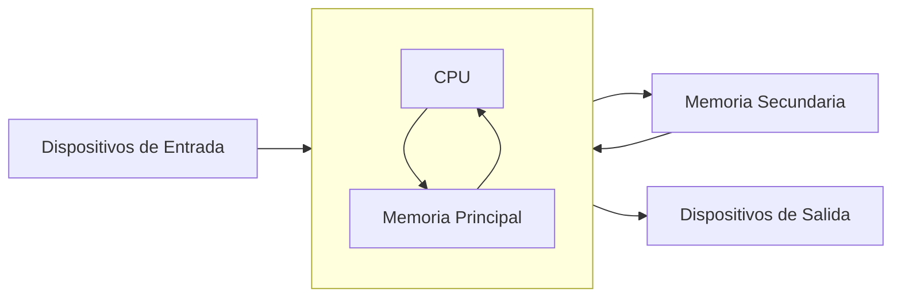

Aunque diferentes computadoras pueden variar significativamente en detalles específicos, en general todas las computadoras digitales modernas son notablemente similares. El gráfico anterior muestra una vista funcional de una computadora. La unidad central de procesamiento (CPU) es el "cerebro" de la máquina. Aquí es donde se llevan a cabo todas las operaciones básicas de la computadora. La CPU puede realizar operaciones aritméticas simples como sumar dos números y también puede realizar operaciones lógicas como comparar si dos números son iguales.

La memoria almacena programas y datos. La CPU puede acceder directamente sólo a la información almacenada en la memoria principal, llamada RAM que significa "Memoria de Acceso Aleatorio". La memoria principal es rápida, pero también volátil. Es decir, cuando se corta la alimentación, la información de la memoria se pierde. Por tanto, también debe haber alguna memoria secundaria que proporcione un almacenamiento más permanente.

En una computadora personal moderna, la memoria secundaria suele ser una unidad de disco duro interna (HDD) o una unidad de estado sólido (SSD). Un HDD almacena información como patrones magnéticos en un disco giratorio, mientras que un SSD emplea circuitos electrónicos conocidos como memoria flash. La mayoría de las computadoras también admiten medios extraíbles para la memoria secundaria, como "memorias USB" (también una forma de memoria flash) y DVD (discos versátiles digitales), que almacenan información como patrones ópticos que se leen y escriben mediante un láser.

Los humanos interactúan con la computadora a través de dispositivos de entrada y salida. Probablemente estés familiarizado con dispositivos comunes como el teclado, el mouse y el monitor (pantalla de video). El CPU procesa la información de los dispositivos de entrada y puede transferirse a la memoria principal o secundaria. De manera similar, cuando es necesario mostrar información, la CPU la envía a uno o más dispositivos de salida.

Entonces, ¿qué sucede cuando inicias tu juego o programa de procesamiento de textos favorito? Primero, las instrucciones que componen el programa se copian desde la persistente memoria secundaria a la volátil memoria principal de la computadora.

Una vez cargadas las instrucciones, la CPU comienza a ejecutar el programa.

Técnicamente, la CPU sigue un proceso llamado ciclo de búsqueda-ejecución. La primera instrucción se recupera de la memoria, se decodifica para descubrir qué representa, y ejecuta la acción apropiada. Luego busca, decodifica y ejecuta la siguiente instrucción. El ciclo continúa, instrucción tras instrucción. En realidad, esto es todo lo que hace la computadora desde el momento en que la enciendes hasta que la vuelves a apagar: buscar, decodificar y ejecutar. No parece muy emocionante, ¿verdad? Pero la computadora puede ejecutar este flujo de instrucciones simples a una velocidad vertiginosa, pasando por miles de millones de instrucciones cada segundo. Si reúne suficientes instrucciones sencillas en la forma correcta, la computadora hará cosas asombrosas.

***

## 1.5. Lenguajes de programación

Recuerda que un programa es sólo una secuencia de instrucciones que le dicen a una computadora qué hacer. Obviamente, debemos proporcionar esas instrucciones en un idioma que una computadora pueda entender. Sería bueno si pudiéramos decirle a una computadora qué hacer usando nuestra lengua materna, como lo hacen en las películas de ciencia ficción. Los científicos computacionales han hecho grandes avances en esta dirección; Es posible que estés familiarizado con tecnologías como Siri (Apple), Google Now (Android) y Cortana (Microsoft). Pero como puede atestiguar cualquiera que haya utilizado seriamente estos sistemas, diseñar un programa informático para comprender plenamente el lenguaje humano sigue siendo un problema sin resolver, aunque cada vez es más facil interactuar con IAs como los chats que usan modelos como GPT.

Incluso si las computadoras pudieran entendernos, los lenguajes humanos no son muy adecuados para describir algoritmos complejos. El lenguaje natural está plagado de ambigüedad e imprecisión. Por ejemplo, si digo "Vi al hombre en el parque con el telescopio", ¿tenía yo el telescopio o el hombre? ¿Y quién estaba en el parque? Nos entendemos la mayor parte del tiempo sólo porque todos los humanos compartimos un vasto acervo de conocimientos y experiencias comunes. Incluso entonces, la falta de comunicación es algo común.

Los matemáticos/informáticos han solucionado este problema diseñando notaciones para expresar los cálculos de una manera exacta e inequívoca. Estas notaciones especiales se denominan lenguajes de programación. Cada estructura en un lenguaje de programación tiene una forma precisa (su sintaxis) y un significado preciso (su semántica). 

Un lenguaje de programación es algo así como un código para escribir las instrucciones que seguirá una computadora. De hecho, los programadores suelen referirse a sus programas como código de computadora, y el proceso de escribir un algoritmo en un lenguaje de programación se llama codificación.

Python es un ejemplo de lenguaje de programación y es el lenguaje que usaremos a lo largo de esta guía. Es posible que hayas oído hablar de otros lenguajes de uso común, como C++, Java, Javascript, Ruby, Perl, Scheme o BASIC. Los informáticos han desarrollado literalmente miles de lenguajes de programación, y los propios lenguajes evolucionan con el tiempo dando lugar a múltiples versiones, a veces muy diferentes. Aunque estos lenguajes difieren en muchos detalles, todos comparten la propiedad de tener una sintaxis y una semántica bien definidas y sin ambigüedades.

Todos los lenguajes mencionados anteriormente son ejemplos de lenguajes informáticos de alto nivel. Aunque son precisos, están diseñados para ser utilizados y comprendidos por humanos. Estrictamente hablando, el hardware de una computadora sólo puede comprender un lenguaje de muy bajo nivel conocido como lenguaje de máquina.

Supongamos que queremos que la computadora sume dos números. Las instrucciones que realmente lleva a cabo la CPU podrían ser algo como esto:

```MACHINE
    LOAD R1, 2001   ; Cargar el número desde la dirección de memoria 2001 en el registro R1
    LOAD R2, 2002   ; Cargar el número desde la dirección de memoria 2002 en el registro R2
    ADD R1, R2      ; Sumar el contenido de los registros R1 y R2 y almacenar el resultado en R1
    STORE 2003, R1  ; Almacenar el contenido del registro R1 en la dirección de memoria 2003
```

Parece mucho trabajo sumar dos números, ¿no? En realidad, es incluso más complicado que esto porque las instrucciones y los números se representan en notación binaria (como secuencias de O y 1).

```MACHINE
    0001 01 0000 0111 1101 ; LOAD R1, 2001
    0001 10 0000 0111 1101 ; LOAD R2, 2002
    0010 01 10 ; ADD R1, R2
    0011 01 0000 0111 1101 ; STORE 2003, R1
```

En un lenguaje de alto nivel como Python, la suma de dos números se puede expresar de forma más natural: c = a + b. 

Esto es mucho más fácil de entender para nosotros, pero necesitamos alguna forma de traducir el lenguaje de alto nivel al lenguaje de máquina que la computadora pueda ejecutar.

Hay dos formas de hacer esto: **un lenguaje de alto nivel puede compilarse o interpretarse**.

Un **compilador** es un programa informático complejo que toma otro programa escrito en un lenguaje de alto nivel y lo traduce a un programa equivalente en el lenguaje de máquina de alguna computadora.

El *programa de alto nivel* se llama *código fuente* y el *código de máquina* resultante es un *programa ejecutable* con el que la computadora puede interactuar directamente.

El usuario final solamente abre (ejecuta) el *programa ejecutable* e interactúa con él ingresando datos (entradas) y recibiendo los resultados (salidas).


Un **intérprete** es un programa que simula una computadora que comprende un lenguaje de alto nivel. En lugar de traducir el programa fuente a un equivalente en lenguaje de máquina, el intérprete analiza y ejecuta el código fuente instrucción por instrucción según sea necesario.


La diferencia entre interpretar y compilar es que la compilación es una traducción de una sola vez; Una vez compilado un programa, se puede ejecutar una y otra vez sin necesidad del compilador o del código fuente. En el caso interpretado, el intérprete y la fuente son necesarios cada vez que se ejecuta el programa. Los programas compilados tienden a ser más rápidos, ya que la traducción se realiza de una vez por todas, pero los lenguajes interpretados se prestan a un entorno de programación más flexible ya que los programas se pueden desarrollar y ejecutar de forma interactiva.

El proceso de traducción destaca otra ventaja que tienen los lenguajes de alto nivel sobre el lenguaje de máquina: la portabilidad. El lenguaje de máquina de una computadora lo crean los diseñadores de la CPU en particular. Cada tipo de computadora tiene su propio lenguaje de máquina. 

Un programa para el procesador Intel i7 de tu laptop no funcionará directamente en una la CPU ARMv8 de tu teléfono inteligente. Por otro lado, un programa escrito en un lenguaje de alto nivel se puede ejecutar en muchos tipos diferentes de computadoras siempre que exista un compilador o intérprete adecuado (que no es más que un programa más). Como resultado, podemos ejecutar exactamente el mismo programa Python en una computadora portátil y en una tableta; Aunque tienen CPU diferentes, ambos cuentan con un intérprete de Python.


***

## 1.6. La mágia de Python

Ahora que tienes todos los detalles técnicos, es hora de empezar a divertirte con Python. El objetivo final es hacer que la computadora cumpla nuestras órdenes. Para ello, escribiremos programas que controlen los procesos computacionales dentro de la máquina. Ya has visto que no hay magia en este proceso, pero en cierto modo la programación parece mágica.
Los procesos computacionales dentro de la computadora son como espíritus mágicos que podemos aprovechar para nuestro trabajo. 

Desafortunadamente, esos espíritus sólo entienden un lenguaje muy arcano que nosotros desconocemos. Lo que necesitamos es un genio amigable que pueda dirigir a los espíritus para que cumplan nuestros deseos. Nuestro genio es un intérprete de Python. Podemos dar instrucciones al intérprete de Python y él dirige los espíritus subyacentes para llevar a cabo nuestras demandas. 

Nos comunicamos con el genio a través de un lenguaje especial de hechizos y encantamientos (es decir, Python). La mejor manera de empezar a aprender sobre Python es dejar salir a nuestro genio de la botella y probar algunos hechizos.

Con la mayoría de las instalaciones de Python, puede iniciar un intérprete de Python en un modo interactivo llamado shell. Un shell le permite escribir comandos de Python y luego muestra el resultado de ejecutarlos. Los detalles para iniciar un shell difieren según las distintas instalaciones. Si está utilizando la distribución estándar de Python para PC o Mac de [www.python.org](https://www.python.org/), debes tener una aplicación llamada IDLE (Integrated Development and Learning Environment) que te permitirá interactuar con Python 

Si aún no tienes Python instalado, lee nuestra [guía de instalación](../Guías/01_Instalación_Python.md).

Comencemos abriendo la aplicación IDLE.

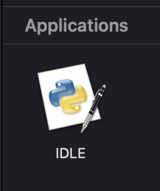

Cuando inicies IDLE (u otro shell de Python) por primera vez, deberías ver algo como esto:

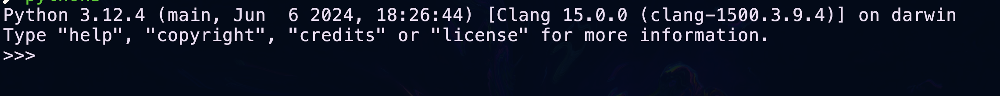

El mensaje de apertura exacto depende de la versión de Python que estés ejecutando y del sistema en el que estés trabajando. La parte importante es la última línea; el  `>>>` es un mensaje de Python que indica que nuestro genio (el intérprete de Python) está esperando que le demos una orden. En los lenguajes de programación, un comando completo se llama declaración.

Aquí hay un ejemplo de interacción con un shell de Python:

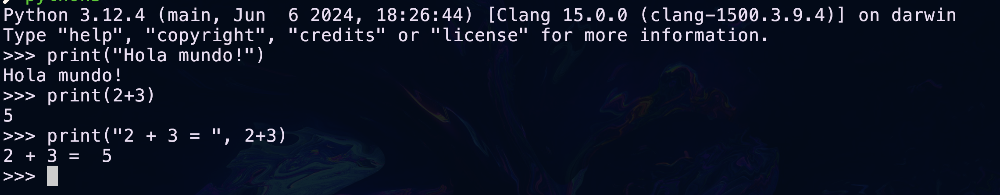

Aquí he probado tres ejemplos utilizando la declaración de impresión (`print`) de Python. 

- La primera declaración le pide a Python que muestre la frase literal *"Hola mundo!"*. Python responde en la siguiente línea imprimiendo la frase. 

- La segunda declaración de impresión le pide a Python que imprima la suma de *2 y 3*. 

- La tercera impresión combina estas dos ideas. Python imprime la parte entre comillas, "*2 + 3 =*", seguida del resultado de sumar 2 + 3, que es *5*.

Este tipo de interacción de shell es una excelente manera de probar cosas nuevas en Python. A lo largo de esta guía se encuentran fragmentos de sesiones interactivas. Cuando veas el mensaje de Python `>>>` en un ejemplo, debería indicarte que se está ilustrando una sesión interactiva. Es una buena idea iniciar su propio shell de Python y probar los ejemplos.

Por lo general, queremos ir más allá de los fragmentos de una línea y ejecutar una secuencia completa de declaraciones. Python nos permite juntar una secuencia de declaraciones para crear un comando o función completamente nueva. A continuación se muestra un ejemplo de cómo crear una nueva función llamada "**hola**":

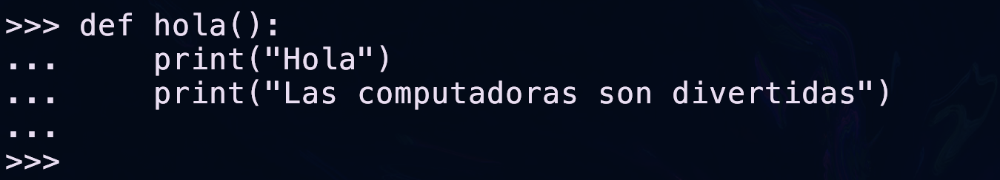

La primera línea le dice a Python que estamos definiendo una nueva función y la llamaremos **hola**. Las siguientes líneas tienen sangría para mostrar que son parte de la función **hola**. 

!!! note "Nota"
    Algunos shells imprimirán puntos suspensivos ["`...`"] al principio de las líneas con sangría.

La línea en blanco al final (que se obtiene presionando la tecla `<ENTER>` dos veces) le permite a Python saber que la definición ha finalizado y el shell responde con `>>>` para que continuemos interactuando. Ten en cuenta que escribir la definición no hizo que Python imprimiera nada todavía. Le hemos dicho a Python lo que debería suceder cuando la función **hola** se usa como comando; En realidad, todavía no le hemos pedido a Python que lo realice.


Una función se invoca (o llama) escribiendo su nombre seguido de paréntesis. Esto es lo que sucede cuando usamos nuestro comando **hola**:


¿Ves lo que esto hace? Las dos declaraciones de impresión de la definición de la función **hola** se ejecutan en secuencia.

Quizás te preguntes acerca de los paréntesis en la definición y el uso de **hola**. Los comandos pueden tener partes *variables* llamadas parámetros (también llamados argumentos) que se colocan entre paréntesis. Veamos un ejemplo de un saludo personalizado usando un parámetro. Primero la definición:


Ahora podemos utilizar nuestro saludo personalizado.


¿Puedes ver lo que está pasando aquí? Al usar **saludo** podemos enviar diferentes nombres para personalizar el resultado. También puedes notar que esto se parece a las declaraciones impresas anteriores. En Python, imprimir es un ejemplo de función incorporada. Cuando llamamos a la función de `print()`, los parámetros entre paréntesis le indican a la función qué imprimir.

Discutiremos los parámetros en detalle más adelante. Por el momento lo importante a recordar es que los paréntesis deben incluirse después del nombre de la función siempre que queramos ejecutar una función. Esto es cierto incluso cuando no se proporcionan parámetros. Por ejemplo, puede crear una línea de salida en blanco usando `print` sin ningún parámetro.

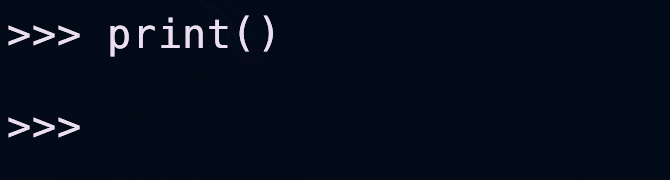

Pero si escribes sólo el nombre de la función, omitiendo los paréntesis, la función en realidad no se ejecutará. En cambio, una sesión interactiva de Python mostrará algún resultado que indique a qué función se refiere ese nombre, como muestra esta interacción:


El texto extraño 0x101211da0 es la ubicación (dirección) en la memoria de la computadora donde se almacena la definición de la función de saludo. Si estás probando esto en tu propia computadora, es casi seguro que verás una dirección diferente.

Un problema al ingresar funciones interactivamente en un shell de Python como lo hicimos con los ejemplos de **hola** y **saludo** es que las definiciones se pierden cuando salimos del shell. Si queremos volver a utilizarlos la próxima vez, tendremos que escribirlos de nuevo. Los programas generalmente se crean escribiendo definiciones en un archivo separado llamado **módulo** o **script**. Este archivo se guarda en la memoria secundaria para que pueda usarse una y otra vez.

Un archivo de **módulo** es simplemente un archivo de texto y puede crear uno usando cualquier aplicación para editar texto, como un bloc de notas o un procesador de textos, siempre que guarde su programa como un archivo de "texto sin formato". Un tipo especial de aplicación conocida como **Entorno de Desarrollo Integrado (IDE)** simplifica el proceso. 

Un IDE está diseñado específicamente para ayudar a los programadores a escribir programas e incluye funciones como sangría automática, resaltado de colores y desarrollo interactivo. IDLE es un buen ejemplo. Hasta ahora hemos estado usando IDLE como shell de Python, pero en realidad es un entorno de desarrollo simple pero completo.

Ilustremos el uso de un archivo de módulo escribiendo y ejecutando un programa completo. Nuestro programa explorará un concepto matemático conocido como caos.

A lo largo de la guía desarrollaremos varios programas, por lo que sugeriría que crees una carpeta para mantener todos tus programas organizados y juntos en un espacio dedicado en tu área de documentos personales.

El proceso se puede hacer de diferentes maneras, pero yo ilustraré como hacerlo mediante una línea de comandos (**Terminal** en caso de Mac y **PowerShell** en caso de Windows) y el editor de código VSCode, si no tienes instalado el editor de código te sugerimos seguir nuestra guía de instalación de [VSCode](../Guías/02_Instalación_VSCode.md).

Comencemos abriendo la aplicación de línea de comandos correspondiente. 

**MacOS**

- Presiona la combinación de teclas `<COMMAND>` y `<ESPACIO>` (cuando hablemos de combinaciones de teclas escibiremos las diferentes teclas separadas por un símbolo `+`, ejemplo:`<COMMAND> + <ESPACIO>`) para desplegar el buscador spotlight.

    

- Escribe "Terminal" en la barra de búsqueda de spotlight.

    

- Notarás que una aplicación está resaltada en gris, bastará con presionar la tecla `<ENTER>` para ejecutarla y abrirá una pantalla (la interfaz difererirá de la que yo muestro), a partir de este momento me referiré a esta interfaz que acabamos de abrir como **shell**.

    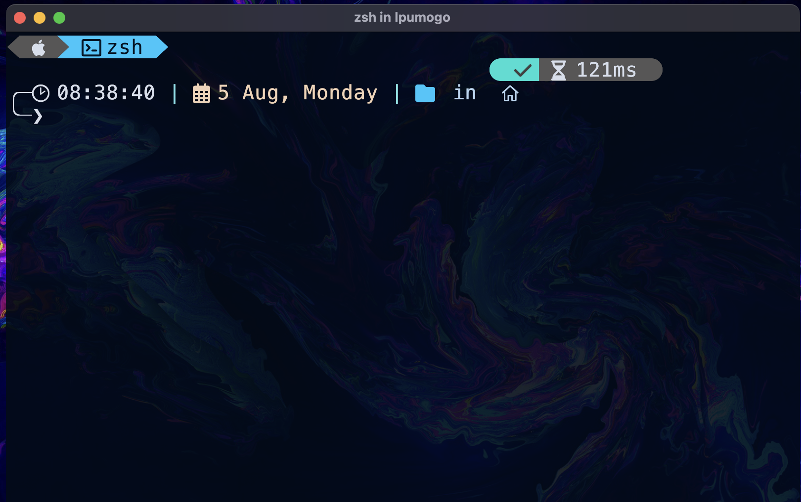

**Windows**

- Presiona la combinación de teclas `<WINDOWS>` y `<R>` (cuando hablemos de combinaciones de teclas escibiremos las diferentes teclas separadas por un símbolo `+`, ejemplo:`<WINDOWS> + <R>`) para desplegar la aplicación run.

    

- Escribe "powershell" en la barra de búsqueda.

    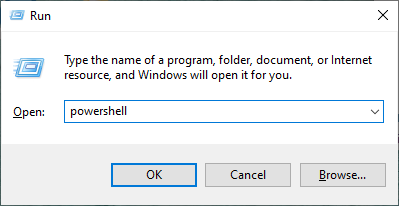

- Para ejecutar la aplicación bastará con presionar la tecla `<ENTER>` o dar click en el botón "`OK`". Abrirá una pantalla como la siguiente, a partir de este momento me referiré a esta interfaz que acabamos de abrir como **shell**.

    

Deberemos crear la carpeta donde guardaremos los programas que realicemos durante esta guía, situarnos en ella y abrirla en el editor de código, para ello dentro de nuestra shell (no importa si es Windows o Mac) ingresaremos los siguientes comandos:

```LINUX
mkdir ./intro_progra
```
```LINUX
cd ./intro_progra
```
```LINUX
code .
```

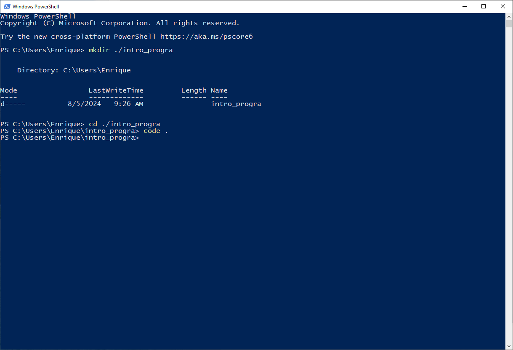

Si todo el paso anterior se ejecutó correctamente, se debió abrir la aplicación Visual Studio Code, primero encontraremos una advertencia que nos pregunta si confiamos en el autor de la carpeta "intro_progra", como nosotros mismos somos el autor, sí podemos confiar, así que debemos dar click en el botón que dice "Sí, confío en los autores (Yes, I trust the authors)".


Se removerá la ventana de autorización y tendremos nuestro editor listo para trabajar.


Comenzaremos ubicando el explorador de archivos, si no se ha personalizado la interfaz, lo encontraremos en la parte izquierda.

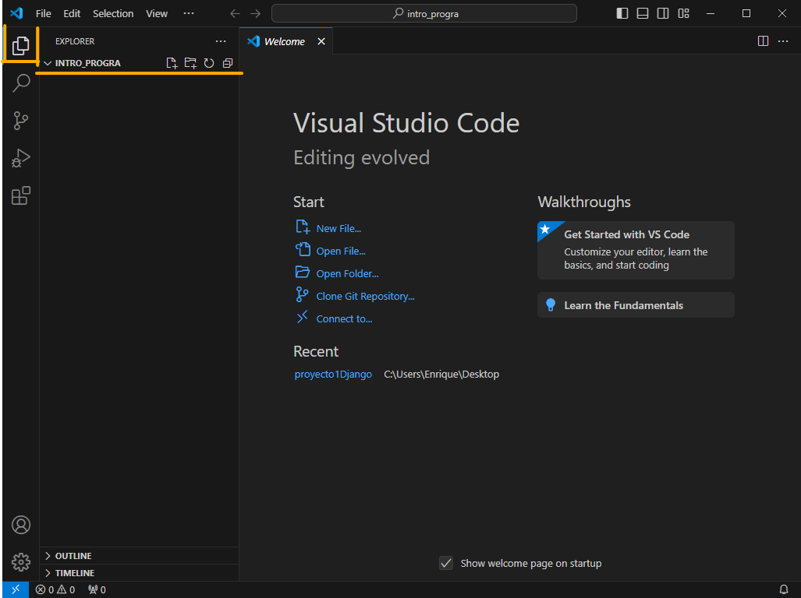

En el explorador tendremos varíos íconos, de izquierda a derecha, el primero nos permitirá crear un nuevo archivo, el segundo crear una nueva carpeta, el tercero refrescar el explorador y el cuarto colapsar los folder abiertos en el explorador, de momento solo interactuaremos con el primer botón.

Damos click en él e inmediatamente por debajo se habilitará un recuadro que nos permitirá escribir, ahí ingresaremos el nombre de nuestro fichero, en este caso será "*01_caos.py*" y una vez terminemos de escribir presionaremos la tecla `<ENTER>`.

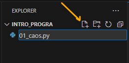

En la parte derecha del editor encontraremos nuestro archivo *01_caos.py* listo para ser editado, ahí pegamos el siguiente código.


```python
# caos.py
# Un programa que ilustra una conducta caótica

def main():
    print("Este programa ilustra una función caótica") 
    x = eval(input("Ingresa un número entre 0 y 1: ")) 
    for i in range(10):
        x = 3.9 * x * (1 - x)
        print(x)

main()
```

Una vez que lo hayas escrito, notarás que el ícono del explorador tiene una alerta azul con un número 1, esto indica que dentro de nuestro entorno de trabajo existe un archivo que se ha editado, pero no se han guardado los cambios. 

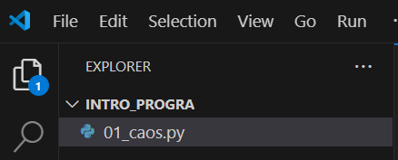

Para guardar el script usamos la combinación de teclas `<Ctrl+S>` en Windows y `<Command+S>` en Mac.

Tú editor se debería ver de la siguiente manera, sin alertas a la izquierda y con el código completo a la derecha.

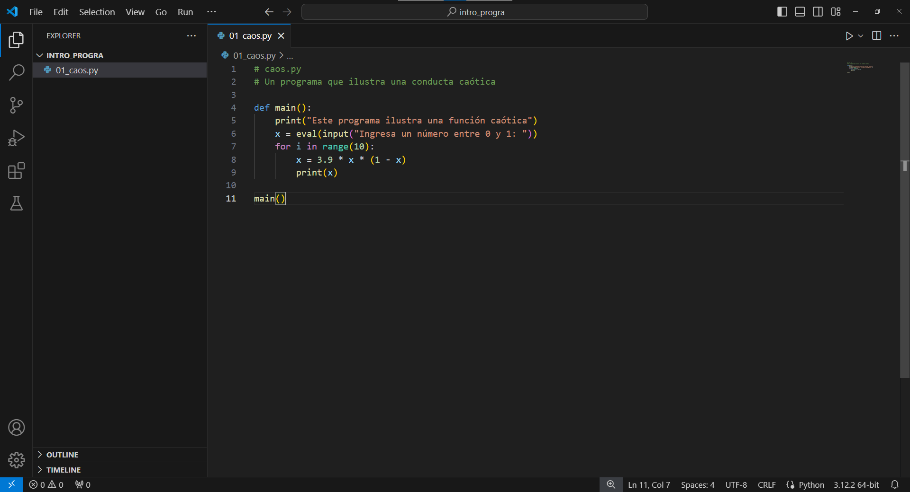


En este punto, es posible que estés intentando encontrarle sentido a lo que acabas de copiar. Puedes ver que este ejemplo en particular contiene líneas para definir una nueva función llamada "*main*". (Los programas suelen colocarse en una función llamada *main*). 

La última línea del archivo (línea 11) es el comando para invocar esta función. No te preocupes si no comprendes qué hace realmente main; lo discutiremos en la siguiente sección. El punto aquí es que una vez que tenemos un programa guardado en un archivo de módulo como este, podemos ejecutarlo cuando queramos.

Nuestro programa se puede ejecutar de varias maneras diferentes que dependen del sistema operativo real y del entorno de programación que estés utilizando.

Nosotros lo ejecutaremos desde nuestra shell, para ello debemos retomar nuestra shell desde la que creamos la carpeta y abrimos el VSCode.

Si estamos en **Windows** nuestra shell debe verse así.


Si estamos en **Mac** nuestra shell debe verse así.


El comando que nos ejecutar nuestro programa en **Windows** es:

 ```BASH
 python 01_caos.py
 ```

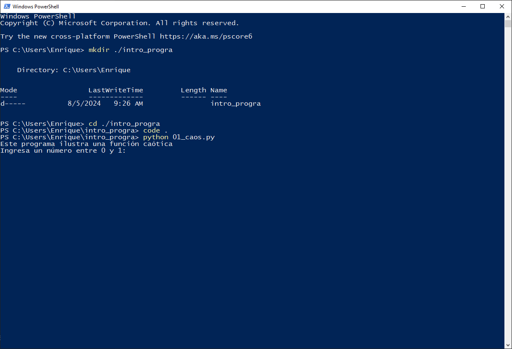

El comando que nos ejecutar nuestro programa en **Mac** es:

 ```BASH
 python3 01_caos.py
 ```


El programa en ejecución le pide al usuario que ingrese un número entre 0 y 1 yo escribiré ".25".


Lo que ocurrió aquí es que le indicamos a la computadora que ejecutará la serie de instrucciones que definimos en el programa **01_caos.py** con Python, Python interpreta el módulo (programa) de arriba a abajo, línea por línea. Es como si los hubiéramos escrito uno por uno en el indicador interactivo de Python. 

La definición en el módulo hace que Python cree la función principal (líneas 4 a 9). La última línea (línea 11) de este módulo hace que Python invoque la función principal, ejecutando así nuestro programa. 

El programa ya en ejecución le pide al usuario que ingrese un número entre 0 y 1 y luego imprime una serie de 10 números.

??? note "Compilación/interpretación en Python"

    Python es un lenguaje interpretado, pero cuenta con un proceso híbrido de compilación/interpretación.

    Si ejecutamos el código fuente mediante el comando:

    ```BASH
    python 01_caos.py
    ```

    Solamente estamos interpretando. Sin embargo, es posible que el código fuente de Python en el archivo del módulo (01_caos.py) se compile en instrucciones más primitivas llamadas **código de bytes**.

    ¿Por qué haríamos eso?

    Porque tener un archivo en código de bytes hace que la ejecución sea más rápida la segunda vez. Si el código de un módulo se va a emplear en repetidas ocasiones, vale la pena que exista en código de bytes.

    Para que Python compile nuestro módulo, empleamos el comando:

    ```BASH
    python -m py_compile 01_caos.py
    ```
    Este comando no interpretará el código permitiendo que interactuemos inmediatamente con él. En su lugar, creará una carpeta llamada pycache dentro de la carpeta donde se almacenan los archivos de nuestro módulo. Este es un lugar donde Python guardará archivos complementarios con extensión .pyc (los archivos .pyc son las versiones en código de bytes de nuestro código fuente).

    En este ejemplo, Python podría crear otro archivo llamado 01_caos.pyc.

    Tener un archivo .pyc disponible hace que la ejecución de un módulo sea más rápida la segunda vez. Sin embargo, puede eliminar los archivos de código de bytes si desea ahorrar espacio en el disco; Python los recreará automáticamente según sea necesario.

    Generalmente no tendrás que hacer la compilación manual de tus módulos de Python, él interprete está programado para saber cuando optimizar un módulo. 

***

## 1.7. Dentro de un programa de Python

El resultado del programa **01_caos.py** puede no parecer muy relevante, pero ilustra un fenómeno muy interesante conocido por físicos y matemáticos. Echemos un vistazo a este programa línea por línea y veamos qué hace. No te preocupes por comprender cada detalle de inmediato; Volveremos a todas estas ideas en la próxima sección.

Las dos primeras líneas del programa comienzan con el carácter `#`:


Estas líneas se llaman ***comentarios***. Están destinadas a los lectores humanos del programa y Python las ignora. 

**El intérprete de Python siempre omite cualquier texto desde el signo de número (#) hasta el final de una línea.**

La siguiente línea del programa comienza la definición de una función llamada **main**:


Estrictamente hablando, no sería necesario crear una función **main**. Dado que las líneas de un módulo se ejecutan a medida que se cargan, podríamos haber escrito nuestro programa sin esta definición. Es decir, el módulo podría haber quedado así:


Esta versión es un poco más corta, pero se acostumbra colocar las instrucciones que componen un programa dentro de una función llamada **main**. 

Un beneficio inmediato de este enfoque se ilustró anteriormente; nos permite ejecutar el programa simplemente invocando `main()`. No tenemos que reiniciar el shell de Python para ejecutarlo nuevamente, lo cual sería necesario en el caso sin **main**.

La primera línea dentro de main es realmente el comienzo de nuestro programa.


Esta línea hace que Python imprima un mensaje presentando el programa cuando se ejecuta.

Veamos la siguiente línea del programa:


Aquí `x` es un ejemplo de una ***variable***. Una variable se utiliza para darle un nombre a un valor para que podamos hacer referencia a él en otros puntos del programa.

La línea completa es una declaración para obtener información del usuario. Están sucediendo muchas cosas en esta línea y discutiremos los detalles en el próximo capítulo; por ahora, sólo necesitas saber qué logra. 

Cuando Python llega a esta declaración, muestra el mensaje citado *"Ingrese un número entre 0 y 1:"* y luego hace una pausa, esperando que el usuario escriba algo en el teclado y presione la tecla `<ENTER>`. 

El valor que escribe el usuario se almacena como la variable x. En el primer ejemplo mostrado arriba, el usuario ingresó . 25, que se convierte en el valor de x.

La siguiente declaración es un ejemplo de un bucle.


Un bucle es un mecanismo que le dice a Python que haga lo mismo una y otra vez. Este bucle en particular dice que hagamos algo 10 veces. Las líneas con sangría debajo del encabezado del bucle son declaraciones que se realizan 10 veces. Estos forman el cuerpo del bucle.


El efecto del bucle es exactamente el mismo que si hubiéramos escrito el cuerpo del bucle 10 veces:

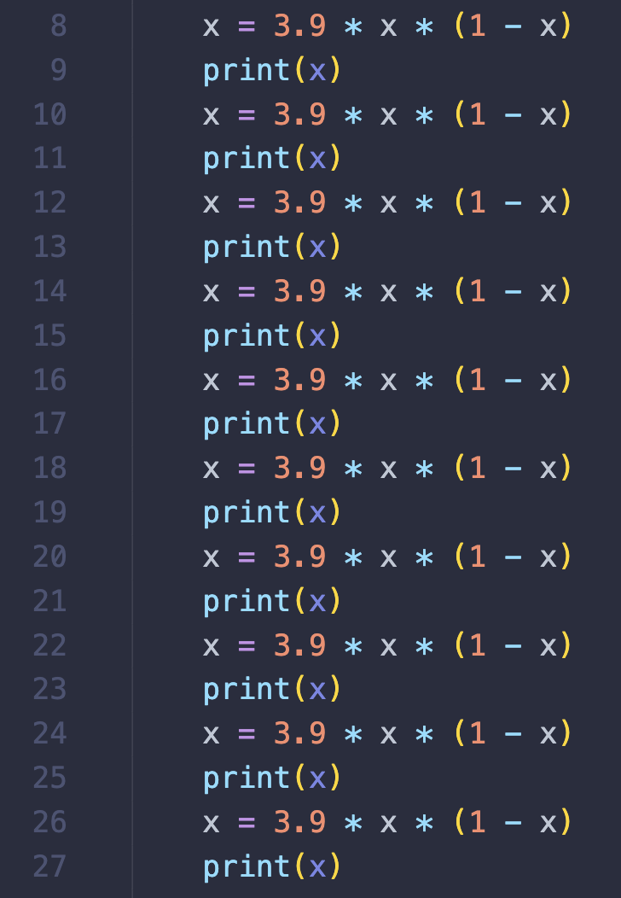

Obviamente, usar el bucle le ahorra muchos problemas al programador.

Pero ¿qué hacen exactamente estas declaraciones? 

La primera realiza un cálculo.

`x = 3.9 * x * (1 - x)`

A esto se le llama **declaración de asignación**. 

La parte del lado derecho del `=` es una expresión matemática (`3.9 * x * (1 - x)`). 

Python usa el carácter `*` para indicar la multiplicación. 

Recuerde que el valor de `x` es `0.25` (en la entrada de ejemplo). 

El valor calculado es `3.9(0.25)(1 - 0.25)`. 

Una vez que se calcula el valor del lado derecho, se guarda (o se asigna) en la variable que aparece en el lado izquierdo del `=`, en este caso `x`. El nuevo valor de `x` (`0.73125`) reemplaza el valor anterior
(`0.25`).

La segunda línea en el cuerpo del bucle es un tipo de declaración que hemos encontrado antes, una declaración de `print()`, que imprime el valor de `x`.

Cuando Python ejecuta esta declaración, el valor actual de `x` se muestra en la pantalla. Entonces, el primer número de salida es `0.73125`.

Recuerde que el bucle se ejecuta 10 veces. Después de imprimir el valor de `x`, las dos declaraciones del bucle se ejecutan nuevamente.

Por supuesto, ahora `x` tiene el valor `0.73125`, por lo que la fórmula calcula un nuevo valor de `x` como `3.9(0.73125)(1 - 0.73125)`, que es `0.76644140625`.

¿Puedes ver cómo se usa el valor actual de x para calcular un nuevo valor cada vez que se realiza el ciclo? 

De ahí provienen los números del ejemplo. Puedes intentar seguir los pasos del programa tu mismo con tu calculadora para un valor de entrada diferente (por ejemplo, 0.5), anota los resultados en un cuaderno y toma el tiempo que tardas en hacer las 10 iteraciones. 

Luego ejecuta el programa usando Python y ve qué tan bien te fue haciéndote pasar por una computadora.

***

## 1.8. Caos y computadoras

Anteriormente dije que el programa **01_caos.py** ilustra un fenómeno interesante. ¿Qué podría tener de interesante una pantalla llena de números? Si pruebas el programa por ti mismo, descubrirás que, sin importar con qué número comiences, el programa devuelve 10 números aparentemente aleatorios entre 0 y 1. A medida que se ejecuta el programa, el valor de x parece saltar, sin ningún patrón, es decir caóticamente.

La función calculada por este programa tiene la forma general: `k(x)(1 - x)`, donde `k` en este caso es `3. 9`. 

Esto se llama función logística. Modela ciertos tipos de circuitos electrónicos inestables y a veces también se utiliza para modelar la variación de la población en condiciones límite. La aplicación repetida de la función logística puede producir caos. Aunque nuestro programa tiene un comportamiento subyacente bien definido, el resultado parece impredecible.

Una propiedad interesante de las funciones caóticas es que diferencias muy pequeñas en el valor inicial pueden generar grandes diferencias en el resultado cuando la fórmula se aplica repetidamente. Puedes ver esto en nuestro programa, ingresando números que difieren sólo en una pequeña cantidad (una centésima por ejemplo). 

Aquí está el resultado de un programa modificado que muestra los resultados para los valores iniciales de 0.25 y 0.26 uno al lado del otro:


Con valores iniciales muy similares, los resultados permanecen similares durante algunas iteraciones, pero luego difieren notablemente. Aproximadamente en la quinta iteración, ya no parece haber ninguna relación entre los dos modelos.

Estas dos características de nuestro programa **01_caos.py**, la aparente imprevisibilidad y la extrema sensibilidad a los valores iniciales, son las características distintivas del comportamiento caótico. 

El caos tiene implicaciones importantes para la informática. Resulta que muchos fenómenos del mundo real que nos gustaría modelar y predecir con nuestras computadoras exhiben precisamente este tipo de comportamiento caótico.

Seguramente habrás oído hablar del llamado [efecto mariposa](https://es.wikipedia.org/wiki/Efecto_mariposa). Los modelos informáticos que se utilizan para simular y predecir patrones climáticos son tan sensibles que, el efecto de una sola mariposa batiendo sus alas en Nueva Jersey podría marcar la diferencia en si se pronostica lluvia o no en Illinois.

Es muy posible que incluso con un modelo informático perfecto, nunca podamos medir las condiciones meteorológicas existentes con suficiente precisión como para predecir el tiempo con más de unos pocos días de antelación. Las mediciones simplemente no pueden ser lo suficientemente precisas como para que las predicciones sean precisas en un período de tiempo más largo.

Como puedes ver, este pequeño programa tiene una valiosa lección para enseñar a los usuarios de computadoras. 

***Por más sorprendentes que sean las computadoras, los resultados que nos brindan son tan útiles como los modelos matemáticos en los que se basan los programas.*** 

Las computadoras pueden dar resultados incorrectos debido a errores en los programas, pero incluso los programas correctos pueden producir resultados erróneos si los modelos son incorrectos o las entradas iniciales no son lo suficientemente precisas.

***

## 1.9. Resumen de la sección

En esta sección se han introducido los siguientes conceptos las computadoras, la informática y la programación.
A continuación se muestra un resumen de algunos de los conceptos clave:

- Una computadora es una máquina universal de procesamiento de información. Puede llevar a cabo cualquier proceso que pueda describirse con suficiente detalle. Una descripción de la secuencia de pasos para resolver un problema particular se llama algoritmo. Los algoritmos se pueden convertir en software (programas) que determina lo que el hardware (máquina física) puede lograr. El proceso de creación de software se llama programación.

- La informática es el estudio de la información que se puede procesar automáticamente. Los informáticos utilizan las técnicas de diseño, análisis y experimentación. La informática es la base áreas como redes, bases de datos y sistemas de gestión de la información, por nombrar algunas.

- Una vista funcional básica de un sistema informático comprende una unidad central de procesamiento (CPU), memoria principal, memoria secundaria y dispositivos de entrada y salida. La CPU es el cerebro de la computadora que realiza operaciones aritméticas y lógicas simples. La información sobre la que actúa la CPU (datos y programas) se almacena en la memoria principal (RAM). La información más permanente se almacena en dispositivos de memoria secundaria, como discos magnéticos, memoria flash y dispositivos ópticos. La información se ingresa en la computadora a través de dispositivos de entrada y los dispositivos de salida muestran los resultados.

- Los programas se escriben utilizando una notación formal conocida como lenguaje de programación. Hay muchos lenguajes diferentes, pero todos comparten la propiedad de tener una sintaxis (forma) y una semántica (significado) precisas. El hardware de la computadora entiende sólo un lenguaje de muy bajo nivel conocido como lenguaje de máquina. Los programas generalmente se escriben utilizando lenguajes de alto nivel orientados a humanos, como Python. Un lenguaje de alto nivel debe compilarse o interpretarse para que la computadora lo comprenda. Los lenguajes de alto nivel son más portátiles que el lenguaje de máquina.


- Python es un lenguaje interpretado. Una buena forma de aprender sobre Python es utilizar un shell interactivo para experimentar. La distribución estándar de Python incluye un programa llamado IDLE que proporciona un shell y funciones para editar programas de Python.

- Un programa Python es una secuencia de comandos (llamados declaraciones) que debe ejecutar el intérprete de Python. Python incluye declaraciones para hacer cosas como imprimir resultados en la pantalla, obtener información del usuario, calcular el valor de una expresión matemática y realizar una secuencia de declaraciones varias veces (bucle).

- Un modelo matemático se llama caótico si cambios muy pequeños en la entrada conducen a grandes cambios en los resultados, haciéndolos parecer aleatorios o impredecibles. Los modelos de muchos fenómenos del mundo real exhiben un comportamiento caótico, lo que impone algunos límites al poder de la computación.

***

## 1.10. Ejercicios

??? question "Verdadero o falso"
    1. La informática es el estudio de las computadoras.
    2. El CPU es el "cerebro" de la computadora.
    3. La memoria secundaria se llama RAM.
    4. Toda la información en la que está trabajando una computadora actualmente se almacena en la memoria principal.
    5. La sintaxis de un lenguaje es su significado y la semántica es su forma.
    6. Una definición de función es una secuencia de declaraciones que define un nuevo comando.
    7. Un entorno de programación se refiere a una oficina donde trabajan los programadores.
    8. Una variable se utiliza para dar un nombre a un valor para que se pueda hacer referencia a él en otros lugares.
    9. Se utiliza un bucle para saltar una sección de un programa.
    10. Una función caótica no puede ser calculada por una computadora.

??? question "Un algoritmo es como" 

    a) un periódico 
    
    b) un manifiesto 
    
    c) un tambor 
    
    d) una receta

??? question "¿Cuál es la cuestión fundamental de la informática?" 

    a) ¿A qué velocidad puede calcular una computadora?

    b) ¿Qué información que se puede procesar automáticamente (computar)?

    c) ¿Cuál es el lenguaje de programación más eficaz?
    
    d) ¿Cuánto dinero puede ganar un programador?

??? question "Un problema es intratable cuando" 

    a) no se puede revertir su solución

    b) involucra transistores

    c) tiene muchas soluciones

    d) no es práctico resolver

??? question "¿Cuál de los siguientes no es un ejemplo de memoria secundaria?" 

    a) RAM 
    
    b) disco duro 
    
    c) unidad flash USB 
    
    d) DVD

??? question "Los lenguajes informáticos diseñados para ser utilizados y comprendidos por humanos son" 

    a) lenguajes naturales
    
    b) lenguajes informáticos de alto nivel
    
    c) lenguajes de máquina
    
    d) lenguajes de búsqueda y ejecución

??? question "Una declaración es" 

    a) una traducción del lenguaje de máquina

    b) un comando completo de computadora 
    
    c) una descripción precisa de un problema 
    
    d) una sección de un algoritmo

??? question "Una diferencia entre un compilador y un intérprete es" 

    a) un compilador es un programa
    
    b) un compilador se usa para traducir lenguaje de alto nivel a lenguaje de máquina 
    
    c) un compilador ya no se necesita después de traducir un programa
    
    d) un compilador procesa el código fuente

??? question "Por convención, las declaraciones de un programa a menudo se colocan en una función llamada" 

    a) import 
    
    b) main 
    
    c) program 
    
    d) IDLE

??? question "¿Cuál de las siguientes afirmaciones no es cierta respecto de los comentarios?" 

    a) Hacen que un programa sea más eficiente.
    
    b) Están destinados a lectores humanos.
    
    c) Python los ignora.
    
    d) En Python, comienzan con el signo de almohadilla (#).

??? question "Los elementos enumerados entre paréntesis de la definición de una función se denominan" 

    a) paréntesis

    b) parámetros
    
    c) argumentos
    
    d) tanto **b** como **c** son correctos

??? example "Sesión interactiva"
    Inicie una sesión interactiva de Python e intente escribir cada uno de los siguientes comandos. Anota los resultados que veas.

    ```python
    print("Hello, world!")
    ```

    ```python
    print("Hello", "world!")
    ```

    ```python
    print(3)
    ```

    ```python
    print(3.0)
    ```

    ```python
    print(2 + 3)
    ```

    ```python
    print(2.0 + 3.0)
    ```

    ```python
    print("2" + "3")
    ```

    ```python
    print("2+ 3=", 2+ 3)
    ```

    ```python
    print(2 * 3)
    ```

    ```python
    print(2 ** 3)
    ```

    ```python
    print(7 / 3)
    ```

    ```python
    print(7 // 3)
    ```

??? example "Ejecución de programas de Python"
    Ingresa y ejecute el programa **01_caos.py** de la Sección 1.6. Pruébelo con varios valores de entrada para ver que funciona como se describe en el capítulo.

??? example "Edición de programas de Python"
    Modifica el programa **01_caos.py** usando 2.0 en lugar de 3.9 como multiplicador en la función logística. Su línea de código modificada debería verse así:

    ```python
    x = 2.0 * x * (1 - x)
    ```

??? example "Edición de programas de Python"
    Modifica el programa **01_caos.py** para que imprima 20 valores en lugar de 10.

??? example "Edición de programas de Python"
    Modifica el programa **01_caos.py** para que el usuario determine el número de valores a imprimir.

??? tip "Solo leeme en caso de que necesites ayuda con el ejercicio anterior"
    Tendrás que agregar una línea cerca de la parte superior del programa para obtener otro valor del usuario

    ```python
    n = eval(input("¿Cuántos números debo imprimir? "))
    ```
    Luego necesitarás cambiar el bucle para usar `n` en lugar de un número específico.

